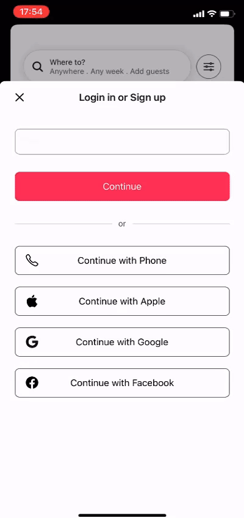

# Airbnb Mobile

This repository contains a mobile application project inspired by Airbnb, developed using Expo SDK 50. The project consists of clones of some screens from the Airbnb application.

## Prerequisites

Make sure you have [Expo](https://expo.io/) installed on your machine before proceeding. Additionally, you need to have the package manager [PNPM](https://pnpm.io/) installed.

## How to Run the Project

To run the project, follow the steps below:

1. Clone this repository to your local machine.
2. Navigate to the project directory.
3. Run the following command to install the dependencies:
    `pnpm install || npm install`

4. After the dependencies are installed, start the Expo project with the following command:
    `npx expo start`

## Screenshots/GIFs of the Application

  

    
1. Login Screen:

    
  

  

    
2. Explore Places

    
  

  

    
3. Place Details

    
  

## Contribution

Contributions are welcome! If you'd like to contribute to this project, please open an issue to discuss the changes you want to make.

## License

This project is licensed under the [MIT License](LICENSE).
